# 内分泌系统

## 药理学
### 抗甲状腺药
- [[甲状腺激素]]
- [[硫脲类]]
- [[碘及碘化物]]
- [[放射性碘]]
- [[β受体阻断药]]

### 胰岛素及口服降糖药
- [[胰岛素]]
- [[磺酰脲类]]
- [[格利奈类]]
- [[双胍类]]
- [[胰岛素增敏剂]]
- [[α-葡萄糖苷酶抑制药]]

### 肾上腺皮质激素类药
- [[糖皮质激素类药物]]


``` dataview
TABLE
	en
FROM #药物 AND #内分泌系统
SORT en
```

# 生殖系统

## 药理学
### 作用于男性生殖系统的药物
- [[雄激素类药]]
- [[同化激素类药]]
- [[抗雄激素类药物]]
- [[治疗前列腺增生的药物]]
	- [[α肾上腺素受体阻断药]]
	- [[5α还原酶抑制药]]
- [[治疗勃起功能障碍的药物]]
	- [[雄激素类药]]
	- [[磷酸二酯酶5抑制药]]
	- [[多巴胺D2受体激动药]]
	- [[注射和经尿道给药的药物]]

### 作用于女性生殖系统的药物
- [[雌激素类药]]
- [[抗雌激素类药]]
- [[孕激素类药]]
- [[抗孕激素类药]]
- [[避孕药]]
- [[子宫平滑肌兴奋药]]

``` dataview
TABLE
	en
FROM #药物 AND #生殖系统 
SORT en
```


# note
## 糖尿病
根据您提供的复旦大学病理学课件《内分泌系统的疾病》中关于**糖尿病**的部分（特别是第83-105页），我们可以系统地梳理**2型糖尿病（T2DM）的并发症及其发病机理**。文件内容与临床病理学高度一致，以下是基于课件的详细归纳：

---

### **一、 T2DM并发症概览（课件P87，P105）**

课件明确指出，**99%的糖尿病患者会出现合并症**，主要包括：
1.  **微血管并发症**：由长期高血糖直接导致。
    *   **糖尿病视网膜病变**：**成人致盲的第一原因**。
    *   **糖尿病肾病**：导致肾衰竭（10-20%）。
    *   **糖尿病神经病变**：50%患者出现。
2.  **大血管并发症**：高血糖加速动脉粥样硬化所致。
    *   **心血管疾病**：**心肌梗死是最常见的死因**，50%死于心血管事件。
    *   **脑血管疾病**：中风。
    *   **外周血管疾病**：导致下肢缺血、坏疽，是**非创伤性截肢的第一原因**。
3.  **其他并发症**：
    *   白内障、青光眼。
    *   感染风险增加。
    *   皮肤瘙痒、视物模糊等。

---

### **二、 发病机理（核心：高血糖的毒性作用，课件P88-90）**

课件重点阐述了高血糖导致组织损伤的**三条核心生化通路**，这是并发症发生的共同基础：

**1. 晚期糖基化终末产物形成**
*   **机理**：持续高血糖导致葡萄糖与蛋白质、脂质、核酸发生非酶促反应，形成不可逆的**AGEs**。
*   **危害**：
    *   **使基底膜弥漫性增厚**（微血管病变的基础）。
    *   与细胞膜上的AGE受体结合，激活炎症信号通路。
    *   与细胞外基质交联，改变其结构和功能，促进动脉粥样硬化。

**2. 蛋白激酶C通路激活**
*   **机理**：高血糖导致葡萄糖代谢中间产物（如磷酸二羟丙酮）增加，进而使合成**二酯酰甘油**的底物增多，最终激活**蛋白激酶C**。
*   **危害**：激活的PKC参与调控多种基因表达，导致：
    *   血管通透性增加。
    *   基底膜合成增加。
    *   促凝血物质表达上调。
    *   促进新生血管形成（与视网膜病变相关）。

**3. 多元醇通路代谢紊乱**
*   **机理**：正常时葡萄糖主要经糖酵解代谢。高血糖时，大量葡萄糖经**醛糖还原酶**催化转化为**山梨醇**，再经山梨醇脱氢酶转化为果糖。
*   **危害**：
    *   **山梨醇在细胞内蓄积**，引起高渗性损伤，导致细胞水肿（如神经雪旺细胞、晶状体上皮细胞）。
    *   消耗大量**NADPH**（重要的抗氧化剂），使细胞易受氧化应激损伤。
    *   **“肌醇耗竭”学说**：山梨醇通路活跃和葡萄糖竞争性抑制，导致神经细胞肌醇摄取减少，影响Na⁺-K⁺-ATP酶活性，最终导致神经传导速度减慢，这是**糖尿病神经病变**的重要机制。

---

### **三、 各器官并发症的病理形态学改变（课件P91-102）**

**1. 胰腺（P92）**
*   **特征性改变**：**胰岛内淀粉样物质沉积**（与1型糖尿病的胰岛炎不同）。
*   胰岛数量和大小减少，β细胞轻度耗竭。

**2. 血管病变**
*   **大血管病变（P93）**：**加速的动脉粥样硬化**。累及大中动脉，导致冠心病、脑梗死、下肢坏疽。
*   **微血管病变（P94）**：全身毛细血管和微动脉的**基底膜弥漫性增厚**，是糖尿病特征性改变，见于视网膜、肾小球、神经滋养血管等。

**3. 肾脏—糖尿病肾病（P95-100）**
*   **肾小球病变**：
    *   **弥漫性肾小球系膜硬化**：系膜基质普遍增多。
    *   **结节性肾小球系膜硬化（Kimmelstiel-Wilson结节）**：系膜区出现圆形的均质蜡样结节，具有诊断特异性。
*   **血管病变**：入球和出球小动脉均发生**玻璃样变性**（高血压通常仅累及入球小动脉）。
*   **肾盂肾炎和肾乳头坏死**：更常见且严重。

**4. 眼睛（P102）**
*   **视网膜病变**：微动脉瘤、出血、渗出（非增殖期）；新生血管形成、纤维增生、视网膜剥离（增殖期）。
*   **白内障、青光眼**：发病率增加。

**5. 神经—糖尿病神经病变（P101）**
*   周围神经对称性脱髓鞘和轴索变性，以下肢运动感觉神经为主。
*   自主神经亦可受累，导致胃肠、膀胱、性功能障碍。

**6. 其他**
*   **皮肤**：易感染、胫前色素斑。
*   **肝脏**：脂肪肝常见。

---

### **四、 临床表现（课件P103-104）**
*   **典型“三多一少”**：多尿、多饮、多食、体重减轻。
*   **其他**：乏力、皮肤瘙痒、视物模糊、易感染。
*   **急性并发症**：高血糖高渗状态、糖尿病酮症酸中毒（在T2DM应激状态下也可发生）。

### **总结**
这份课件清晰地勾勒出T2DM并发症的全景：
*   **根源**是慢性高血糖。
*   **核心机制**是AGEs形成、PKC激活、多元醇通路紊乱三大生化通路异常。
*   **靶器官损伤**表现为特征性的微血管基底膜增厚、大血管加速粥样硬化，以及由此引发的视网膜、肾脏、神经、心脏等多系统病变。
*   **最终结局**是极高的致残率（失明、截肢、肾衰）和致死率（主要因心血管事件）。

理解这一病理链条，对于糖尿病的管理（不仅控糖，还需综合管理血压、血脂）和并发症的预防至关重要。


## 月经周期
好的，这是一个关于女性生殖周期非常核心的知识点。我将为您系统梳理**子宫内膜周期、对应的激素水平以及卵巢内卵泡的变化**，这三者同步发生，紧密相连，构成了月经周期。

### **核心关系总览**
月经周期通常以**28天**为一个典型周期，以**排卵日**（第14天左右）为界，分为两个阶段：
1.  **卵泡期/增殖期**：月经第1-14天。由**雌激素**主导。
2.  **黄体期/分泌期**：月经第15-28天。由**孕激素**主导。

下图直观地展示了在一个典型28天周期中，子宫内膜、卵巢及核心激素的同步变化关系：

```mermaid
gantt
    title 女性28天月经周期同步变化图
    dateFormat D
    axisFormat %d日
    
    section 卵巢周期
    卵泡期 : 1, 14d
    排卵 : crit, 14, 1d
    黄体期 : 15, 14d
    
    section 卵泡发育
    原始卵泡募集 : 1, 5d
    优势卵泡选择与生长 : 6, 9d
    成熟卵泡（排卵） : 14, 1d
    黄体形成与功能期 : 15, 12d
    黄体退化（白体） : 27, 2d
    
    section 子宫内膜周期
    月经期（脱落） : 1, 5d
    增殖期（修复生长） : 6, 9d
    分泌期（转化、为着床准备） : 15, 13d
    缺血期（脱落前奏） : 28, 1d
    
    section 核心激素水平
    FSH（促卵泡激素）高峰 : 1, 4d
    LH（黄体生成素）高峰 : crit, 13, 2d
    雌激素（E2）高峰 : 12, 3d
    孕激素（P）高峰 : 20, 8d
```



---

### **分期详细解析**

#### **第一阶段：卵泡期 / 子宫内膜增殖期**
**时间**：月经第1-14天（以排卵结束）。
**主导激素**：**雌激素**。
**目标**：促进卵泡发育和子宫内膜修复生长。

| 组成部分 | 具体变化 |
| :--- | :--- |
| **卵巢变化** | 1. **卵泡募集**：一批窦状卵泡（约10-15个）在FSH作用下开始发育。<br>2. **优势卵泡选择**：约第7天，其中一个卵泡成为“优势卵泡”，其余闭锁。<br>3. **卵泡成熟**：优势卵泡在FSH和LH共同作用下继续增大，分泌雌激素增多，颗粒细胞产生抑制素抑制FSH。 |
| **激素水平** | • **FSH**：月经初期升高，促进卵泡生长，后因雌激素和抑制素的负反馈而略下降。<br>• **LH**：维持在较低水平，后期缓慢上升。<br>• **雌激素**：由发育的卵泡分泌，**持续稳定上升**，在排卵前达到第一个高峰。 |
| **子宫内膜** | • **月经期**：因上周期黄体萎缩，雌、孕激素撤退，内膜功能层缺血坏死脱落，与血液混合排出（第1-5天）。<br>• **增殖期**：月经停止后，在雌激素作用下，内膜基底层细胞开始修复，腺体增多、增长、变直，间质致密，螺旋动脉增生（第6-14天）。内膜从约1mm增厚至3-5mm。 |

#### **排卵**
**时间**：月经第14天左右。  
**触发机制**：**雌激素的第一个高峰**对下丘脑-垂体产生**正反馈**，引发 **“LH峰”** 。  
**过程**：LH峰促使成熟卵泡壁破裂，次级卵母细胞连同透明带、放射冠被排出卵巢。

#### **第二阶段：黄体期 / 子宫内膜分泌期**
**时间**：月经第15-28天（排卵后至下次月经前）。  
**主导激素**：**孕激素**。 
**目标**：为可能的受精卵着床准备一个“肥沃”的内膜环境。

| 组成部分 | 具体变化 |
| :--- | :--- |
| **卵巢变化** | 1. **黄体形成**：排卵后的卵泡壁塌陷，颗粒细胞和内膜细胞在LH作用下黄素化，形成富含血管的**黄体**。<br>2. **黄体功能**：黄体分泌大量**孕激素**和**雌激素**。<br>3. **黄体结局**：若未受精，黄体在排卵后9-10天开始退化，变为**白体**。 |
| **激素水平** | • **LH**：排卵后迅速下降。<br>• **FSH**：维持在低水平。<br>• **雌激素**：排卵后暂时下降，随后随着黄体成熟出现**第二个高峰**（但低于第一个）。<br>• **孕激素**：**显著升高**，在排卵后约7-8天达到高峰，是此期的标志性激素。 |
| **子宫内膜** | • **分泌期**：在孕激素的作用下，已增生的内膜发生 **“分泌转化”** 。<br>  - 腺体：更加弯曲，腔内分泌大量糖原等营养物质，呈顶浆分泌。<br>  - 间质：疏松水肿，血管继续增生弯曲。<br>  - 为受精卵着床提供了完美的“土壤”（第15-28天）。内膜厚达5-7mm。 |

---

### **周期的结局（月经来潮）**
*   **若未受精**：黄体萎缩 → 雌、孕激素水平**急剧下降** → 子宫内膜失去激素支持 → 螺旋动脉痉挛收缩 → 内膜功能层缺血坏死、脱落 → **下次月经来潮**。周期重新开始。
*   **若受精**：受精卵发育成的囊胚分泌**人绒毛膜促性腺激素**，其作用类似LH，**支持并延长黄体寿命**，使之变为**妊娠黄体**，继续分泌雌、孕激素以维持妊娠，子宫内膜则进一步蜕膜化。月经暂停。

### **记忆要点**
*   **雌激素** = “建设者”，负责**增生内膜**。
*   **孕激素** = “改造者”，负责将增生内膜**转化为分泌状态**，为着床做准备。
*   **排卵**是**LH峰**触发的。
*   **月经来潮**是**雌、孕激素撤退**的直接结果。

![[04 Attachments/组织学 女性生殖.webp]]

## leydig细胞和sertoli细胞 & 卵泡膜细胞和颗粒细胞的对比
好的，这是一个非常核心且重要的问题。Leydig细胞、Sertoli细胞以及卵泡膜细胞、颗粒细胞，是男女生殖系统功能单位中关键的“搭档”细胞。它们的结构与功能有异曲同工之妙，体现了生殖内分泌学的对称性。

### **核心对比总览**

| 特征 | **睾丸 (Testis)** | **卵巢 (Ovary)** |
| :--- | :--- | :--- |
| **功能单位** | **曲细精管** (生精场所) + **间质** (激素场所) | **卵泡** (卵子发育与激素合成场所) |
| **“支持/营养”细胞** | **Sertoli细胞** | **颗粒细胞** |
| **“激素生成”细胞** | **Leydig细胞** | **卵泡膜细胞** |
| **核心调节激素** | **LH** → 作用于Leydig细胞<br>**FSH** → 作用于Sertoli细胞 | **LH** → 作用于卵泡膜细胞<br>**FSH** → 作用于颗粒细胞 |
| **协同作用** | **“两细胞-两促性腺激素”模型**，共同完成雄激素合成，并支持精子发生。 | **“两细胞-两促性腺激素”模型**，共同完成雌激素合成，并支持卵泡发育。 |

---

### **详细对比解析**

#### **第一组：激素生成细胞 - Leydig细胞 vs. 卵泡膜细胞**

这两类细胞位于性腺的“间质”或“外层”，是**雄激素**的主要生产者，直接受**LH**调控。

| 方面 | **Leydig细胞** | **卵泡膜细胞** |
| :--- | :--- | :--- |
| **定位** | 睾丸曲细精管之间的**间质组织**中。 | 位于卵泡的**最外层**，包裹颗粒细胞层。 |
| **核心功能** | **合成与分泌雄激素**（主要是**睾酮**）。 | **合成雄激素**（主要是**雄烯二酮**）。它是合成雌激素的**前体原料**。 |
| **受体与调控** | 表达**LH受体**。LH刺激其合成睾酮。 | 表达**LH受体**。LH刺激其将胆固醇转化为雄烯二酮。 |
| **分泌产物** | • **睾酮**：直接释放入血，维持男性性征、促进精子发生、负反馈抑制垂体。<br>• 少量直接进入曲细精管，供精子发生所需。 | • **雄烯二酮**：**不直接释放**，而是**扩散进入内层的颗粒细胞**，作为其合成雌激素的底物。<br>• 在黄体期也参与孕激素合成。 |
| **类比关系** | **男性的“雄激素工厂”**，产品（睾酮）直接供应全身和局部。 | **女性的“雄激素前体车间”**，产品（雄烯二酮）作为半成品提供给隔壁的“颗粒细胞工厂”进行深加工。 |

#### **第二组：支持/营养细胞 - Sertoli细胞 vs. 颗粒细胞**

这两类细胞位于性腺的“上皮”或“内层”，直接包裹、滋养生殖细胞，受**FSH**调控，并具有将雄激素转化为活性形式或雌激素的能力。

| 方面 | **Sertoli细胞** | **颗粒细胞** |
| :--- | :--- | :--- |
| **定位** | 位于**曲细精管上皮内**，细胞底部附着于基膜，顶部伸向管腔，包绕各级生精细胞。 | 位于**卵泡内层**，紧密排列，包绕卵母细胞，形成卵丘。 |
| **核心功能** | 1. **构成血-睾屏障**，提供免疫豁免的微环境。<br>2. **营养、支持、保护生精细胞**。<br>3. **吞噬残余胞质**。<br>4. **分泌雄激素结合蛋白**。 | 1. **营养、支持卵母细胞**发育。<br>2. 在FSH作用下**大量增殖**，形成卵泡腔（窦卵泡）。<br>3. **合成与分泌雌激素**。 |
| **受体与调控** | 表达**FSH受体**和**雄激素受体**。FSH和睾酮共同调节其功能。 | 表达**FSH受体**和**芳香化酶**。FSH刺激其增殖并激活芳香化酶。 |
| **关键转化作用** | 胞内含有**5α-还原酶**，能将来自Leydig细胞的**睾酮转化为双氢睾酮**，这是精子发生所必需的局部高浓度雄激素。 | 胞内含有**芳香化酶**，能将来自卵泡膜细胞的**雄烯二酮转化为雌二醇**。这是卵泡期雌激素的主要来源。 |
| **分泌产物** | • 雄激素结合蛋白、抑制素、激活素、抗米勒管激素等。<br>• 营养因子、液体。 | • **雌二醇**（主要产物）、抑制素、激活素。<br>• 卵泡液、黏多糖。 |
| **类比关系** | **“精子保姆与管家”**：为精子发生提供结构支持、营养和特化的激素微环境。 | **“卵子保姆与雌激素工厂”**：为卵子提供结构支持和营养，并将隔壁提供的原料加工成最终产品（雌激素）。 |

---

### **核心协同模型：“两细胞-两促性腺激素模型”**

这是理解它们如何合作的核心理论，在卵巢中尤为经典：

1.  **LH** 作用于 **卵泡膜细胞/Leydig细胞**，刺激其利用胆固醇合成**雄激素**。
2.  产生的雄激素（雄烯二酮/睾酮）**扩散到相邻的颗粒细胞/Sertoli细胞**。
3.  **FSH** 作用于 **颗粒细胞/Sertoli细胞**，分别激活**芳香化酶**或**5α-还原酶**。
4.  **在颗粒细胞中**：芳香化酶将雄烯二酮转化为**雌二醇**。
5.  **在Sertoli细胞中**：5α-还原酶将睾酮转化为**双氢睾酮**（局部作用）。

**总结：**
*   **LH** 驱动 **“激素生成细胞”** 生产**原料**。
*   **FSH** 驱动 **“支持细胞”** 利用原料生产**最终活性产物**，并执行支持生殖细胞发育的核心功能。

这种精妙的细胞分工与合作，是保证配子正常生成和性激素精确合成的结构基础。


## 中西医
根据你提供的PDF内容，以下是你所提三个问题的具体答案：

---

### 1. 了解中西医结合治疗疾病的历史和观念

**中西医结合的历史发展**：

- 19世纪至20世纪初，西医内分泌学开始建立（如1849年Berthold的睾丸移植实验、1905年Starling提出“激素”概念）。
- 中医在生殖内分泌方面有悠久的历史，早在《黄帝内经》中已有关于“肾主生殖”“天癸”等理论。
- 中西医结合在明清时期已有萌芽，如唐容川《血证论》、张锡纯《医学衷中参西录》等著作体现了中西医汇通的思想。
- 现代中西医结合在生殖内分泌疾病治疗中广泛应用，如针灸、中药与西医药物、手术、辅助生殖技术相结合。

**中西医结合的治疗观念**：

- **整体观与个体化**：中医强调整体辨证，因人、因时、因地制宜；西医注重病因病理与靶点治疗。
- **多靶点干预**：中医通过中药、针灸等手段调节多个系统，改善功能性疾病。
- **减少副作用**：中西医结合可减少西药剂量、缩短疗程、降低毒副作用。
- **功能调节与结构改善并重**：既改善症状，又调节内分泌轴功能。

---

### 2. 熟悉中医治疗的常用手段

**中医常用治疗手段**：

- **中药治疗**：  
  常用方剂如六味地黄丸、右归丸、二仙汤、桂枝茯苓丸等，用于补肾、调经、安胎、调理更年期等。

- **针灸治疗**：  
  - **体针**：常用穴位如关元、中极、三阴交、子宫穴等。  
  - **耳针**：常用穴位如内分泌、肾上腺、卵巢、子宫等。  
  - **电针**：配合电刺激增强疗效，常用于促排卵、调节内分泌。

- **艾灸与穴位贴敷**：  
  温通经络，适用于寒湿凝滞、肾阳虚等证型。

- **拔罐与穴位埋线**：  
  用于减肥、促进代谢、调节内分泌。

- **食疗与生活方式调节**：  
  如冬瓜粥、荷叶粥、海带汤等，配合适量运动如太极拳、散步。

- **中医诊断方法**：  
  四诊合参（望、闻、问、切），结合舌诊、脉诊进行辨证论治。

---

### 3. 了解针刺治疗围绝经期综合征的可能机制

**针刺治疗围绝经期综合征的可能机制**：

- **调节下丘脑-垂体-卵巢轴**：  
  针刺可影响GnRH释放，调节FSH、LH水平，改善卵巢功能。

- **调节神经递质与内分泌激素**：  
  针刺可调节β-内啡肽、5-羟色胺等神经递质，缓解潮热、情绪波动等症状。

- **改善局部血流与代谢**：  
  针刺可促进卵巢血流，调节脂肪组织代谢，改善胰岛素抵抗。

- **调节交感神经活动**：  
  针刺可降低交感神经兴奋性，缓解心悸、出汗等症状。

- **调节芳香化酶活性**：  
  针刺可影响脂肪、肝脏、脑等组织中芳香化酶的活性，调节雌激素水平。

- **改善行为与情绪**：  
  针刺可减轻焦虑、抑郁等情绪障碍，提高生活质量。

---

如果需要进一步整理成笔记或表格形式，或提取具体数据、图表，也可以告诉我。